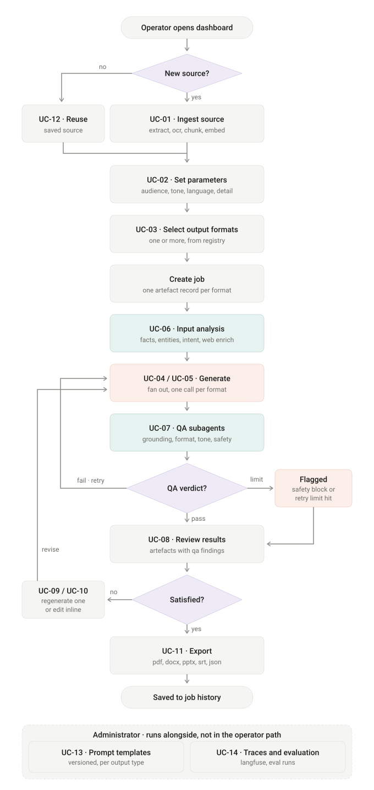

# Use cases

## Actors

| Actor | Role |
|---|---|
| Operator | Primary. Submits content, selects outputs, reviews, exports |
| Reviewer | Optional. Approves artefacts before publication |
| Administrator | Manages prompt templates, models, evaluation runs |
| External systems | LLM providers, web sources |

## Flow



## Register

| ID | Use case | Actor | Priority |
|---|---|---|---|
| UC-01 | Submit source content (text, doc, image, video, URL, prompt) | Operator | must |
| UC-02 | Set generation parameters | Operator | must |
| UC-03 | Select one or more output formats | Operator | must |
| UC-04 | Generate a single artefact | Operator | must |
| UC-05 | Generate multiple artefacts from one source | Operator | must |
| UC-06 | Enrich source with web-retrieved context | System | should |
| UC-07 | Run automated quality checks per artefact | System | must |
| UC-08 | View QA findings and confidence per artefact | Operator | should — cheap, high credit |
| UC-09 | Regenerate one artefact without rerunning the job | Operator | should |
| UC-10 | Edit generated content in place | Operator | cut first |
| UC-11 | Export artefacts | Operator | must |
| UC-12 | View job history; reuse a saved source | Operator | should |
| UC-13 | Manage prompt templates and versions | Administrator | cut second |
| UC-14 | View traces, run evaluations | Administrator | should |

---

## UC-01 — Submit source content

**Precondition:** none (no auth in demo scope).

1. Operator uploads file(s), pastes a URL, or types free-form context
2. System hashes the file; if the hash matches an existing source, reuse it
3. Route to extractor by type; OCR fallback for scanned PDFs
4. Build the normalised content object
5. Chunk (~800 tokens, overlap) and embed into Qdrant with `source_id` payload
6. Return `source_id`; status `ingested`

**Alternates:** unsupported type → reject with the accepted list · extraction yields
near-nothing → OCR → still nothing → fail with a clear message · video over 10 min →
blocked with paywall stub · duplicate hash → return existing `source_id` immediately.

## UC-02 — Set generation parameters

```json
{
  "audience": "general public",
  "tone": "informative, urgent",
  "language": "en",
  "detail": "brief",
  "objective": "drive awareness and patching",
  "style": "plain, no jargon"
}
```

Use **closed vocabularies** (dropdowns), not free text. Predictable templating, and
the tone checker gets something concrete to compare against. Always provide defaults —
an unset parameter means a sensible default, never an empty prompt slot.

Parameters are part of the cache key: changing tone must produce a fresh generation.

## UC-03 — Select output formats

Each selection is validated against the output registry, which supplies prompt
template version, output schema, constraints, model alias and renderer. Unknown ids
are rejected. One artefact record is created per selected format.

## UC-04 / UC-05 — Generate

UC-04 and UC-05 are the **same code path**. One format or six is just the length of
the fan-out.

1. Input analysis runs once, cached on the job
2. Orchestrator fans out one generation job per artefact record
3. Each builds prompt = template + content + analysis + parameters + schema
4. Call via LiteLLM using the registry's `model_alias`
5. Validate returned JSON against schema and constraints
6. Persist artefact, hand to QA

**Alternates:** malformed JSON → parse retry (separate counter) · one generator fails
→ others still complete, failed one marked retryable · provider 429 → LiteLLM
fallback, does not count against QA retries.

## UC-07 / UC-08 — QA and review

Four checkers run in parallel per artefact. Verdict applies the policy in
`ARCHITECTURE.md` §8. Flagged and blocked artefacts still surface in the review view,
marked — hiding them leaves the operator wondering where their deck went.

## UC-09 — Regenerate one artefact

Re-enters at **generation**, not ingestion. Source and analysis are untouched. Carries
operator instructions rather than machine fix notes.

## UC-11 — Export

Renders per the registry's `renderer`. Video package → TTS + SRT + title cards +
ffmpeg. Assets written to object store; download links returned.

## UC-12 — History and source reuse

Recent-sources list on the dashboard. Selecting an existing source skips ingestion and
goes straight to parameters and format selection.

---

## Worked example A — security advisory → LinkedIn post + executive summary

**Source:** 3-page vendor bulletin. Authentication bypass in a VPN appliance, CVSS
9.1, confirmed exploitation in the wild, fixed in 22.7R2.6 released 28 Aug 2026,
~14,000 internet-facing instances affected.

**Parameters:** general public · informative, urgent · en · brief · drive awareness
and patching · plain, minimal jargon.

**Content object:** 4 chunks — c1 severity, c2 exploitation, c3 fix version,
c4 exposure.

**LinkedIn output shape:**

```json
{
  "hook": "If your organisation uses NetGuard Connect Secure, check your version today.",
  "body": "...",
  "call_to_action": "Upgrade to 22.7R2.6 or apply the vendor mitigation today.",
  "hashtags": ["#CyberSecurity", "#VPN", "#PatchNow"],
  "claims": [
    {"text": "rated 9.1 out of 10", "chunk_id": "c1"},
    {"text": "already being exploited", "chunk_id": "c2"},
    {"text": "fix is 22.7R2.6, released 28 August", "chunk_id": "c3"},
    {"text": "around 14,000 systems affected", "chunk_id": "c4"}
  ]
}
```

**Executive summary output shape:** `title` · `bottom_line` · `key_points[]` ·
`recommended_action` · `residual_risk`.

**QA:**

| Checker | LinkedIn | Exec summary |
|---|---|---|
| Grounding | pass 4/4 | pass |
| Format | pass, 812 chars, 3 hashtags | pass |
| Tone | **fail 0.61** — closing line alarmist for stated audience | pass |
| Safety | pass, no exploit detail | pass |

**Fix note:** *"Soften the closing line. Keep urgency factual — reference active
exploitation rather than predicting consequences."*

Retry changes one sentence → 0.84, pass. Two LLM calls for that artefact.

> **This is the demo moment.** One source, two artefacts, no re-analysis, and one
> honest QA catch with a targeted fix. A demo where everything passes first time only
> proves the pipeline runs.

---

## Worked example B — literary excerpt → video package for undergraduates

**Source:** scanned chapter of a copyrighted novel, 12 pages, OCR fallback, 9 chunks.

**Parameters:** undergraduate students · explanatory, engaging · en · moderate ·
support close reading for a seminar · accessible, analytical.

**Branch this triggers:** provenance classified `literary_copyrighted` → generation
switches to **commentary mode**. Narration analyses and paraphrases; quoted spans
capped at short fragments used illustratively. Without this, "make a video from this
excerpt" produces the excerpt read aloud — reproduction, not transformation.

**Output shape:** `scenes[]` each with `narration`, `visual`, `on_screen_text`,
`duration_sec`, `source_chunks[]`; plus `storyboard_notes`, `subtitles_srt`,
`visual_recommendations` (including what to avoid — film stills are separately
licensed), `discussion_prompts`.

**QA:** grounding pass — every scene maps to chunks · format pass — 215s of 240s
target, 5 scenes, subtitles present · tone pass 0.88 · safety pass ·
**source reuse flag** — a five-word on-screen quote.

**Verdict:** pass with note. A short fragment as a title card is fine — this is a
threshold, not a hard gate. A 60-word verbatim passage in narration would block.

> Richest format: exercises script, storyboard, narration, subtitles and visual
> direction at once. Strongest single choice for the 2-minute demo video.
